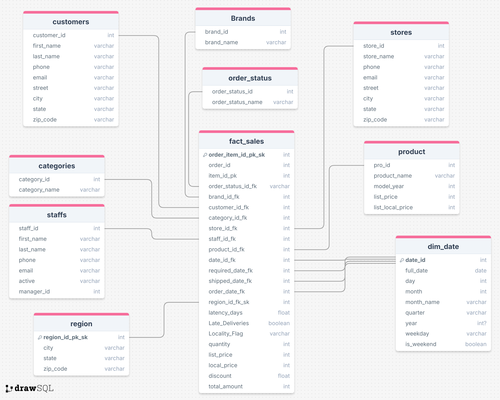

ETL Data Warehouse Project – Detailed Professional Report
1. Project Overview

This project focuses on designing and implementing a complete End-to-End ETL (Extract, Transform, Load) pipeline using Python, Pandas, and MySQL to build a structured Data Warehouse (DWH) that supports analytical reporting and business insights.

The source data consists of multiple CSV files representing transactional and master data such as:

Products

Customers

Orders

Order Items

Brands

Categories

Staffs

Stores

Stocks

Exchange Rates

These datasets were extracted, cleaned, validated, transformed, and prepared for loading into a dimensional data model.

2. Project Objectives

Build a reliable ETL pipeline using Python

Apply data quality checks and data validation rules

Design a Star Schema with Fact and Dimension tables

Prepare clean, consistent data for analytical use

Generate insights and visualizations based on the processed data

3. Tools & Technologies Used

Programming Language: Python

Libraries: Pandas, NumPy, MySQL Connector

Database: MySQL

Data Storage: CSV files (Source & Staging)

Concepts: ETL, Data Warehousing, Star Schema, Data Quality Management

4. ETL Pipeline Architecture

The ETL pipeline is divided into clear, well-defined stages:

4.1 Extract Phase

Data was extracted from multiple CSV files.

Each file represents a specific business entity (Products, Customers, Orders, etc.).

Files were loaded into Pandas DataFrames for processing.

4.2 Transform Phase (Data Cleaning & Validation)

This phase represents the core of the project and includes extensive data quality checks.

4.2.1 Products Dataset

Removed duplicate records

Validated positive values

Handled missing or empty fields

Converted list_price to numeric

Ensured model_year falls within a valid range

4.2.2 Customers Dataset

Removed duplicate records

Validated customer_id uniqueness and positivity

Handled missing first_name

Validated phone number length

Applied regex validation for email format

Filled missing address-related fields with default values

4.2.3 Orders Dataset

Converted date fields to datetime format

Validated no future dates exist

Checked order status values

Validated foreign key IDs (customer, staff, store)

Removed duplicate records

Allowed nullable shipped dates for non-shipped orders

4.2.4 Order Items Dataset

Validated numeric fields: quantity, price, discount

Ensured positive values where applicable

Removed duplicates and handled nulls

4.2.5 Brands & Categories

Validated names are not empty

Ensured IDs are positive

Removed duplicates

Checked extracted dates are not in the future

4.2.6 Staffs Dataset

Validated staff IDs

Handled missing names using email

Validated email and phone formats

Ensured flag consistency

4.2.7 Stores & Stocks

Cleaned address and contact fields

Validated inventory quantities

Ensured valid extracted dates and data sources

All cleaned datasets were saved into a staging layer (staging_1) for loading.

4.3 Load Phase

A MySQL Data Warehouse schema was created using SQL.

Dimension tables and a Fact table were defined.

Cleaned data from the staging layer was loaded into the database.

5. Data Warehouse Schema Design

The project follows a Star Schema design.

5.1 Fact Table

fact_sales

Stores transactional sales data

Includes foreign keys to all dimension tables

Contains measures such as quantity, prices, discounts, and total amounts

5.2 Dimension Tables

dim_product

dim_customer

dim_brand

dim_category

dim_store

dim_staff

dim_date

dim_region

dim_order_status

This structure enables fast analytical queries and reporting.

6. Challenges & Solutions
Challenge	Solution
Missing and inconsistent data	Applied validation rules and default value strategies
Invalid date values	Used datetime coercion and future-date checks
Duplicate records	Identified and removed duplicates systematically
Data format inconsistencies	Standardized formats using Pandas transformations
7. Data Insights (Sample)

Sales performance can be analyzed by product, brand, category, and store

Customer distribution can be studied by city and state

Late deliveries can be identified using delivery latency metrics

Revenue comparison between USD and local currency is supported

8. Visualizations

The following charts were generated using Python and Matplotlib to support analysis:

Total Sales by Category

Revenue by Brand

Monthly Sales Trend

Top Selling Products

Late vs On-Time Deliveries

9. Conclusion

This project demonstrates the complete implementation of a professional ETL pipeline and Data Warehouse solution. By applying strong data quality practices, dimensional modeling, and structured transformations, the final dataset is reliable, scalable, and ready for business intelligence and advanced analytics.
